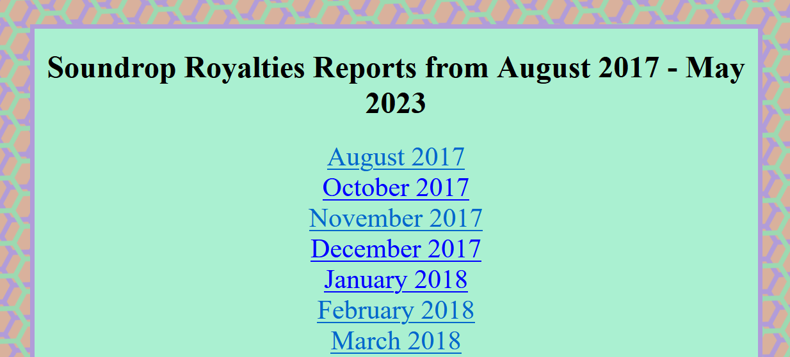
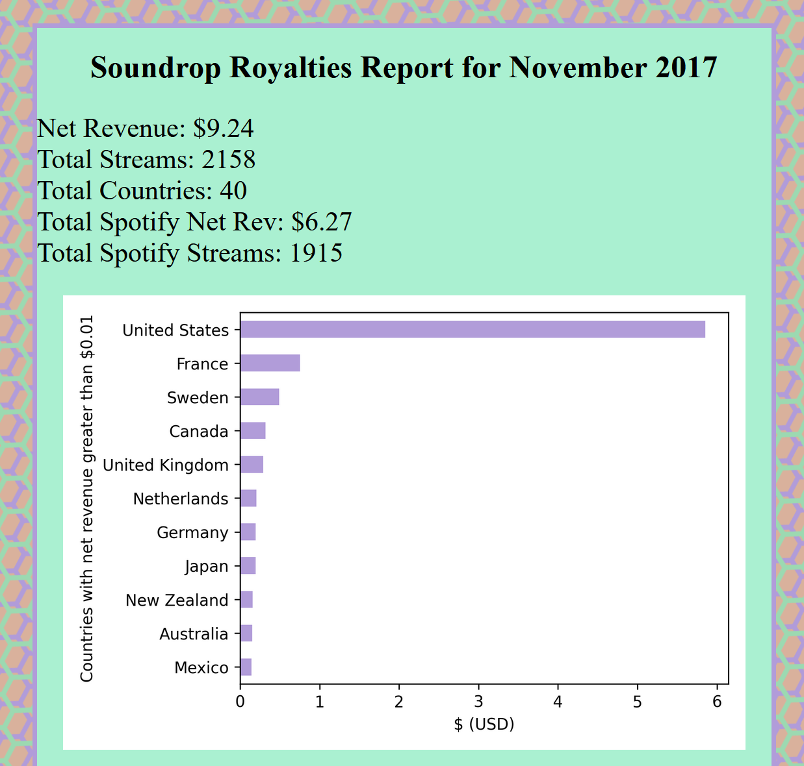

# Soundrop Royalty Report Generator

The Python scripts in this folder will generate Soundrop royalty earnings reports when fed the CSV files that Soundrop emails to artists each month. The focus is on net revenue by country, net revenue by service, streams by service, and streams by release. If you're familiar with pandas, then it will be easy to create plots of other information. 

There is text information for number of streams grouped by track and then grouped by service within that track. Additionally, there is text information for number of streams grouped by country and then grouped by service within that country. This kind of information is difficult to plot effectively, so it's included as just text.

Having coded most of my website from scratch, I'm familiar with HTML and CSS so I wrote these reports out as HTML web pages using the [W3.css](https://www.w3schools.com/w3css/defaulT.asp) "framework". 

A screenshot of the Soundrop royalty report index is shown in the image below.

A screenshot of part of a report entry using real data from November 2017 is shown below.

